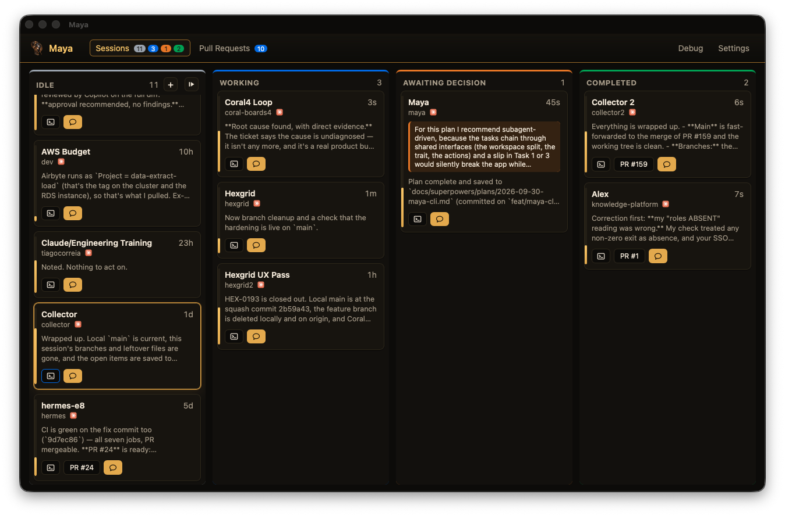

<p align="center">
  
</p>

<h1 align="center">Maya</h1>

<p align="center">Manage All Your Agents</p>

Your coding agents, on one board. Maya tells you when a session needs you
and lets you answer it from the board, or by voice. You do not have to find
the right terminal first.



## What it does

- Shows Claude Code, Codex, Antigravity and Grok Build sessions on one board as cards in a Kanban-like board
  - Each session card lands in a column: Idle, Working, Awaiting Decision or Completed
- Lets you reply, answer questions and run slash commands from the card
- Starts new sessions and resumes old ones
- Tells you when a session needs you
  - Using built-in notifications, and/or a voice and/or a Dock badge
  - Keeps quiet under a Focus mode, or when you mute her from the top bar
- Lists the pull requests that wait for your review, and reviews them in one click
- Does what you tell it by voice: "Maya, tell <session> to do <thing>"
- Shows the sessions of all your machines on one board.
- Runs headless over SSH with the `maya` command.

## Install

Run the commands below, or download Maya manually from the
[latest release](https://github.com/dosaki/maya/releases/latest).

Requirements:

- [Claude Code](https://claude.com/claude-code), installed and signed in.
- The [GitHub CLI](https://cli.github.com/), signed in with `gh auth login`,
  for the Pull Requests tab.
- macOS on Apple Silicon or Intel (macOS 14 or later for voice).
- Windows 10 or 11, 64-bit, with [Git for Windows](https://git-scm.com/download/win).
- Ubuntu 24.04 or later with GNOME, x86_64 or arm64. Other distributions
  with glibc 2.39 or later can run the AppImage.

### macOS

Dependencies (with [Homebrew](https://brew.sh)):

```sh
brew install jq gh && curl -fsSL https://claude.ai/install.sh | bash
```

Maya:

```sh
curl -fsSL https://raw.githubusercontent.com/dosaki/maya/main/install.sh | sh
```

### Linux

Dependencies:

```sh
sudo apt install curl tmux libnotify-bin speech-dispatcher gh && curl -fsSL https://claude.ai/install.sh | bash
```

Maya:

```sh
curl -fsSL https://raw.githubusercontent.com/dosaki/maya/main/install.sh | sh
```

### Windows

Dependencies, in PowerShell:

```powershell
winget install -e --id Git.Git; winget install -e --id GitHub.cli; irm https://claude.ai/install.ps1 | iex
```

Maya, in PowerShell:

```powershell
irm https://raw.githubusercontent.com/dosaki/maya/main/install.ps1 | iex
```

Run the same command again to update Maya.

## First run

1. Open Settings (the tab on the right) and press **Install Claude hook**. The hook
   is what makes "Awaiting Decision" and "Completed" exact; without it a
   permission prompt shows as Working. It never blocks Claude Code and a
   backup of your `settings.json` is taken before every change.
2. Set your **projects directory** (for example `~/dev`) so the "+" can list
   your folders, and a **clones directory** for pull-request reviews.
3. Optionally turn on **Listen for "Maya"** and pick a speech recogniser
   (see Voice).

## Platform notes

### macOS

The installer puts `Maya.app` in `/Applications` (or `~/Applications` when
that is not writable) and clears the quarantine flag, since the builds are
not notarised. Set `MAYA_INSTALL_DIR` to install somewhere else. From the
`.dmg` instead, drag Maya to Applications, and the first time right-click
it and choose Open.

macOS shows the Focus state only to apps with Full Disk Access. Without it
Maya cannot tell that a Focus mode such as Do Not Disturb is on, and keeps
speaking; Settings says so and opens System Settings › Privacy & Security ›
Full Disk Access for you. Turn Maya on there, and let macOS quit and reopen
her.

### Windows

The installer installs Maya for your user (no administrator rights) and
puts it in the Start menu. The builds are not signed, so the `.exe` or
`.msi` from the release makes SmartScreen ask the first time: choose More
info, then Run anyway.

Sessions Maya starts run in Git Bash, in a
[Windows Terminal](https://aka.ms/terminal) window when it is installed.
Install Claude Code with its native installer (the command above), so that
`claude.exe` is on the PATH; npm's `claude.cmd` cannot take the multi-line
prompts Maya sends.

### Linux

The installer puts the AppImage in `~/.local/bin/maya-app` (set
`MAYA_INSTALL_DIR` to put it elsewhere) and adds Maya to the app grid. The
`.deb` from the release (`sudo apt install ./Maya_<version>_amd64.deb`, or `_arm64.deb`)
pulls in the dependencies itself.

For the ElevenLabs voice, also install `pulseaudio-utils` (for `paplay`;
`ffplay` works too) and `libsecret-tools`. Sessions open in GNOME Terminal,
Ptyxis or any `x-terminal-emulator`.

What is different on Linux:

- **Sessions run in tmux.** A session Maya starts or resumes runs in a
  tmux session (`maya-<8 hex>`) shown in a terminal window, and Maya
  types answers and slash commands into it through tmux. A session you
  started by hand outside tmux is on the board and takes replies, but
  Maya cannot type into it and its card has no Terminal button.
- **The Terminal button.** On X11 it raises the window Maya opened
  (with `wmctrl` installed; without it, it opens a new one). On
  GNOME's Wayland, which lets no other app raise a window, it opens a
  fresh window attached to the same tmux session; close the old one when
  you like, the session lives on in tmux.
- **The ElevenLabs key** is kept in GNOME Keyring. The built-in voice is
  speech-dispatcher's, and notifications are GNOME banners (libnotify);
  GNOME's Do Not Disturb keeps Maya quiet.
- **Speech recognition** is *Built-in (Whisper)* only: download a model in
  Settings before turning listening on.
- **The Claude hook** is Maya's own `maya-hook` binary, which ships with
  the app, so the app needs no `jq`.

The Linux build is tested in CI under a virtual display, not yet on real
hardware. On a real Ubuntu machine, check what a virtual display cannot:
that you hear a notification and the voice, that "Maya, what's waiting on
me?" gets an answer, and that Terminal on a card brings up its session.

## Voice

Maya listens for her name and acts on what you say. Everything she can do
from a card she can do by voice: report what is waiting, reply to a
session, answer its question, bring its terminal forward, compact it,
resume or start a session, open or review a pull request.

- **Mute.** The speaker button in the top bar mutes Maya: she says nothing,
  not even her replies (they show in the voice panel), and banners come
  without a sound. Notifications, the badge and the Dock bounce stay.
  Click it again to unmute; Maya remembers it across restarts.
- **Off by default.** Turn on "Listen for 'Maya'" in Settings. A microphone
  appears in the top bar; clicking it opens the voice panel with the
  conversation and a Yes / No for the current read-back. macOS asks for
  microphone and speech-recognition access the first time.
- **The wake word is "Maya".** Say it with the command, or alone: she says
  "Yes?" and waits. When she asks you something back, answer without the
  wake word; she listens for eight seconds and remembers the last few
  exchanges, so "the second one" works.
- **Sending is read back first.** Anything that sends text, answers a
  question, starts or resumes a session or starts a review is read back and
  needs a "yes". Reports, focus and compact happen at once.
- **Two speech recognisers.** *System* uses Apple's on-device recognition,
  which needs Dictation turned on (System Settings › Keyboard › Dictation).
  On a work Mac where that switch is locked by a management profile,
  choose *Built-in (Whisper)* under Settings › Voice assistant › Speech
  recognition and download a model; the 60 MB one is recommended. Windows
  has only *Built-in (Whisper)*: download a model in Settings before
  turning listening on. Maya's built-in voice there is Microsoft Zira.
  Linux, too, has only *Built-in (Whisper)*; its built-in voice is
  speech-dispatcher's.
- **Privacy.** Audio never leaves the computer; both recognisers run on the
  device. Only the text of your command, the last few exchanges, and a
  summary of the board and pull-request list go to Claude, through a
  one-shot `claude -p` call with no tools. The one-off model download is
  the Built-in recogniser's only network access.

The Debug tab shows what she heard, what she made of it, what she asked
Claude, what came back, what ran and what she said. The same lines go to
`~/.claude/maya/maya.log`, which starts afresh on every launch. Paste them
into an issue if something goes wrong.

## Network

Run Maya on multiple machines with one as the **main** and the others as
**assistants**. The main shows all sessions on one board; assistants go
quiet.

- **Main.** Open Settings › Network and choose "Act as main Maya" in the
  Network menu. Choose a port (default 4127) and a name for this machine (its hostname when blank); Maya shows a six-digit
  pairing code at once, valid for five minutes ("Show pairing code" makes
  a new one). The main accepts incoming connections, so macOS asks once
  whether Maya may do so: allow it. To add an assistant, give it the
  code; Maya lists each paired assistant with its platform and IP address
  (and when it was last seen) and lets you remove them. If the port is
  taken, Settings says so under the menu.
- **Assistant.** Choose "Assistant to a main Maya" in the Network menu and
  enter the main's host, port, a name for this machine (its hostname when
  blank) and the pairing code. Pair once; Maya keeps a token and
  reconnects on its own, also after you switch the role Off and back on.
  "Pair again" pairs with a fresh code. A status line shows "Connected to
  <main>", "Reconnecting…" (with the last error under it) or the error.
  On macOS 15 and later, macOS asks once whether Maya may reach devices on
  the local network: allow it.
- **Trust.** Pairing sends the code, in plain text, to the host you typed.
  Whatever answers there must send back proof that it received that code;
  a host that is not a Maya main fails the handshake and the assistant
  keeps nothing. That proof does not show the answer came from your main:
  on a network you do not trust, an impostor that controls the typed host
  could read the code and pair in its place, so pair on a network you
  trust. (A password-authenticated key exchange would close this gap; this
  version does not have one.) After pairing, each side proves it holds the
  token on every connection; an assistant never obeys a main that cannot.
- **Names and addresses.** The main tells machines apart by their IP
  address; names are only labels, on cards and in what Maya says. Two
  assistants with the same name show as "laptop (192.168.1.20)". A machine
  that pairs again from the same address (after a reset, say) keeps its
  place in the list with a new token. So does another machine that later
  gets a disconnected assistant's address (from the router, say) and
  pairs: it takes over that entry.
- **Versions.** Run the same Maya on every machine. The main notes an
  assistant that runs another version, or one whose board it cannot read.
- **What travels.** Session ids, conversation text, option numbers, folder
  names and attachments (up to 20 MB). Commands run on the assistant; the
  main never touches the assistant's files.
- **Plain text on the LAN.** Traffic is not encrypted in this version; all
  data is plain text.
- **Remote cards.** On the main, an assistant's sessions sit in the same
  columns as local ones, with a remote glyph (its tooltip names the
  machine and its address) and the machine's name under the session name
  and no Terminal button; the "+" and resume dialogs get
  a Machine picker, and announcements say "hexgrid on laptop". A card greys
  out thirty seconds after its assistant goes quiet and disappears after
  five minutes; it comes back when the assistant reconnects. Whatever was
  already waiting when an assistant pairs, or when it first connects after
  the main starts, is shown but not announced; only what changes after
  that is. When an assistant reconnects, what began while it was away is
  announced.

### Headless machines (the `maya` command)

A Linux box, a container, or a Mac reached only over SSH can be an assistant
too, with no desktop and no app: the `maya` command line tool.

- **Requirements.** `claude`, `tmux` and `jq` on the PATH (the hook needs
  `jq`; `maya run` and `maya hooks` warn when it is missing), plus `lsof`
  and `ps` to find Codex and Antigravity sessions.

- **Download.** Get the binary for the machine from the
  [latest release](https://github.com/dosaki/maya/releases/latest) and save
  it as `maya` (swap in `maya-linux-aarch64`, `maya-macos-arm64` or
  `maya-macos-x86_64` as needed):

      curl -L -o maya https://github.com/dosaki/maya/releases/latest/download/maya-linux-x86_64 && chmod +x maya

- **Hook.** `./maya hooks install` installs the same Claude Code hook the
  app uses, so Awaiting Decision and Completed are exact.
- **Pair.** `./maya pair <main host> --code <code> --name <label>`, with the
  code from the main's Settings › Network (`--name` is optional; the
  machine's hostname is used when it is left out).
- **Projects.** `./maya config projects-dir <path>` sets the folder whose
  subfolders the main offers for start and resume (`~` works). Until it is
  set, `maya run` warns at start and starting or resuming from the main
  fails.
- **Run.** `./maya run` runs in the foreground, logging to stdout and to
  `~/.claude/maya/maya-cli.log`. Keep it running with whichever fits the
  machine:
  - in `tmux`: `tmux new -d -s maya './maya run'`
  - with `nohup`: `nohup ./maya run >/dev/null 2>&1 &`
  - as a service: a systemd unit (Linux) or launchd agent (macOS) that runs
    `maya run`. A systemd unit needs `KillMode=process`, or stopping the
    unit also kills the tmux server and every session started from the
    main, and an `Environment=PATH=…` that includes `claude`, `tmux` and
    `jq`. A launchd agent likewise needs that PATH in its
    `EnvironmentVariables`.

  Editing `~/.claude/maya/config.json` to another role, or deleting it,
  stops a running `maya run` within seconds (exit 2).
- **What works.** Every action the main can send an assistant: reply,
  answer, compact, rename, change model, effort or mode, start and resume.
  Start and resume land in a tmux session named `maya-<8 hex>`, shown in the
  card's tooltip on the main as `attach: tmux attach -t …`; answering, slash
  commands and Shift+Tab need that session to be inside tmux — a `claude`
  started in a plain SSH shell is shown on the board but can only be
  replied to through its inbox. The CLI never notifies, speaks or listens;
  those stay app-only.
- **What does not.** The CLI does not check pull requests, so cards from a
  headless machine carry no PR badge. Do not run the app and `maya run` on
  the same Mac: they share one pairing in `~/.claude/maya/config.json`, so
  on the main each connection replaces the other.
- **Status.** `./maya status` shows whether it is paired, connected and
  running, and the projects directory; `./maya hooks status` checks the
  hook.

## How it works

Maya does not run an agent of her own; she reads what the agents already
write and drives them through their own interfaces.

- **Sessions** come from the registry Claude Code keeps in
  `~/.claude/sessions/` and the tail of each session transcript. Codex,
  Antigravity and Grok Build sessions are found through their running
  processes and their own session files.
- **States** come from the hook events in `~/.claude/maya/events.jsonl`
  when the hook is installed, with a rule-based reading of the transcript
  as the fallback (a turn that ends in a question is "Awaiting Decision").
- **Replies** go through Claude Code's session inbox (a Unix socket on
  macOS and Linux, a named pipe on Windows), or are typed into the session's
  terminal for the other agents. Slash commands, answers, renames and the
  model, effort and mode changes are typed into the terminal too. On Windows every inbox connection must
  open with the session's token, which Claude Code gives only to the
  session's hooks, so replies there need the hook installed: the hook keeps
  each session's token in `~/.claude/maya/inbox/`, and a session that was
  already running when the hook went in takes replies after its next hook
  event (your next prompt in it, say). On macOS terminal actions use AppleScript and AppKit on
  Terminal.app; on Windows Maya attaches to the session's console to type
  into it and brings its Windows Terminal window forward (the window, not
  the tab, when several sessions share one); on Linux the sessions Maya
  starts run in tmux, which types into them, shown in GNOME Terminal.
- **Pull requests** come from `gh`, refreshed every two minutes.
- **Voice** is a small listener sidecar (Apple's recogniser or whisper.cpp)
  streaming text to Maya; a wake-word and confirmation state machine
  decides what to do; the command, board and pull requests go to Claude
  (Haiku by default) for one JSON action, which Maya validates against the
  board before doing anything.

Settings and data live in `~/.claude/maya/`: `config.json`, `events.jsonl`,
the hook (`hook.sh` on macOS, `maya-hook` on Linux, `maya-hook.exe` on
Windows), `maya.log`, downloaded
speech models under `models/`.

### Windows, for now

- Without `ps` and `lsof`, Maya finds Antigravity sessions in each `agy`
  process's own log (its pid, workspace and conversation), and Codex
  sessions by which `codex` process holds a thread's writer lock. A new
  `agy` shows once its first prompt starts a conversation.
- Focus raises the Windows Terminal window hosting a session; when several
  sessions are tabs of one window, pick the tab yourself.
- The `maya` command line tool drives sessions through tmux, so on Windows
  run it inside WSL.

## Developing

Building from source, cutting a release and code signing are covered in
[docs/DEVELOPING.md](docs/DEVELOPING.md).

### Codex lifecycle hooks

Settings › Sessions offers **Install Codex hook** and **Remove Codex hook**, beside the
**Install Claude hook** and **Remove Claude hook** buttons for Claude Code.
Installation merges Maya's lifecycle handlers into `~/.codex/hooks.json` (or `$CODEX_HOME/hooks.json`),
backs up existing configuration, and preserves other hooks. Restart Codex, then use `/hooks`
to review and trust Maya's hooks before they run. See the [Codex hook documentation](https://learn.chatgpt.com/docs/hooks).

The hooks report prompts, tool calls, permission requests, completion, interruption, and session end.
Maya combines these events with Codex transcripts; process and writer-lock discovery still identifies
live sessions, so a new session can appear after its first message. Events are stored separately in
`~/.claude/maya/codex-events.jsonl`. Windows and Linux use Maya's bundled hook helper; macOS uses `jq`,
as the Claude hook does. Removing hooks leaves other handlers and saved backups intact.
